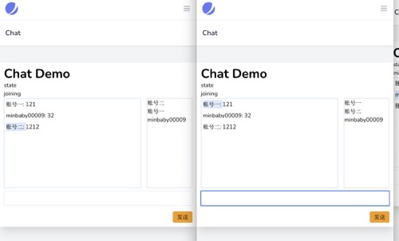
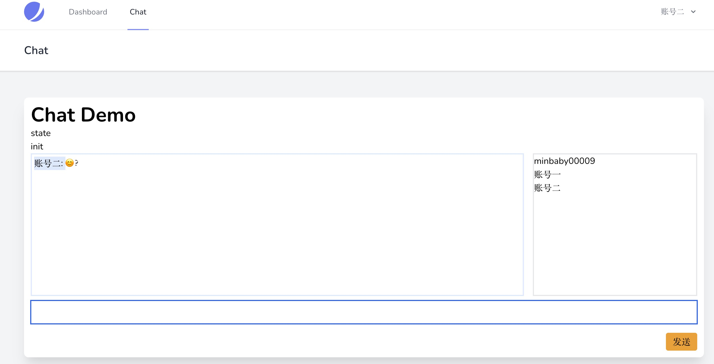

# laravel-chat-demo-with-laravel-echo

## 环境要求

1. php >=7.3
2. node >= v12.18.3 
3. mysql

## 安装依赖

```bash
## 安装 php
composer install

## 安装 node 依赖
yarn
```

## 复制配置文件

```bash
copy .env.example .env
```

## 执行 artisan
```bash
php artisan migrate
```

## 命令行

```bash
composer websocket # start websocket
composer serve # start web server
yarn dev
```

## 预览



